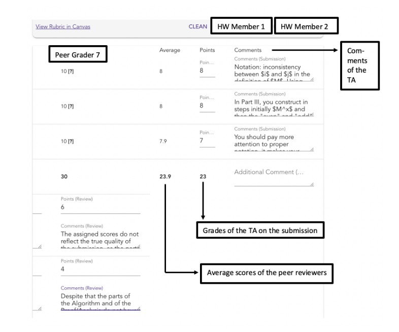
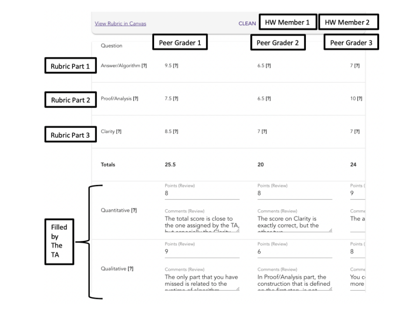

Grader Interface
================
Peer Pal provides a grading matrix that allows the grader to view the submission and a matrix with both
scores and comments of the peers for each rubric element. This grading matrix allows both the submission
to be easily graded by a grader and, if the review assignment is configured with a rubric, for the peer reviews
to be easily graded by a grader.

The grader interface gives a drop down menu with all the submissions for an assignment. Submissions
that are to be graded by a particular grader are marked as such in the drop down menu. While the grader
can grade any of the submissions, the grader must grade the ones that are marked to be graded. Without
these grades the grading algorithms cannot be run.

The grading matrix shows the rubric elements as rows and the peer reviewers as columns. Each entry of
the matrix is comprised of a score from 0 to 10 that is given by the peer. A comment is indicated by [?]
next to the score and mousing over reveals the comment. To the right of the matrix the grader can grade
the submission by entering a numeric score and comment for each rubric element. 

    *Submission grades according to the rubric can be entered on the right side of the grading matrix*

If manual grading of the peer reviews is enabled (by enabling a rubric on the review assignment), then
the grader can grade each review according to the rubric at the bottom of the grading matrix.

    *Review grades for each peer review can be entered according to a rubric (if one is configured) on the bottom of the grading matrix*