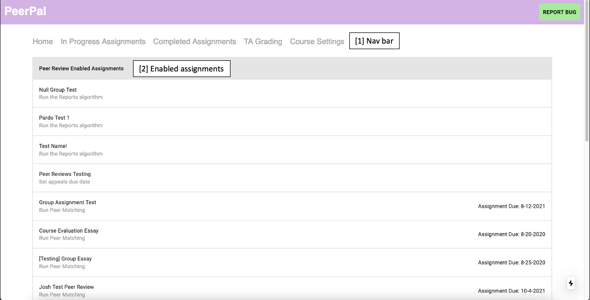
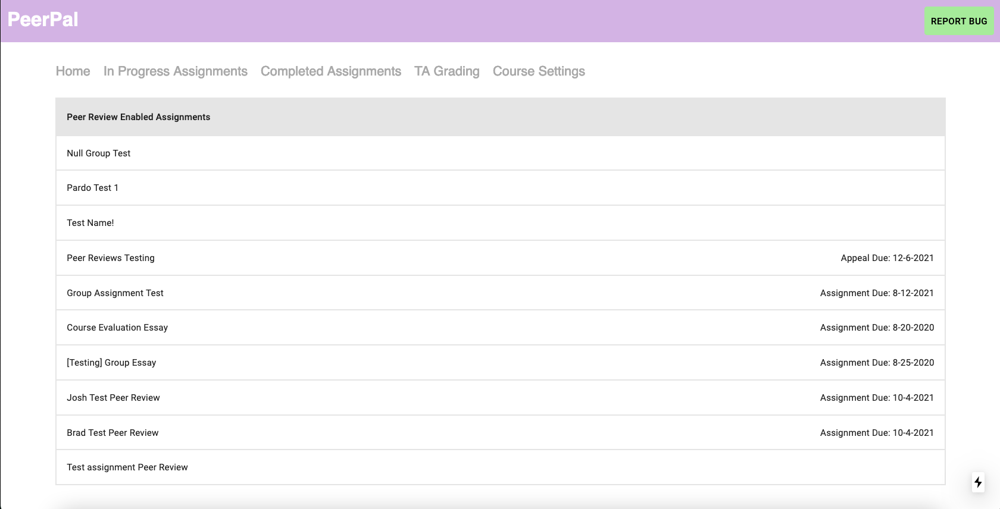
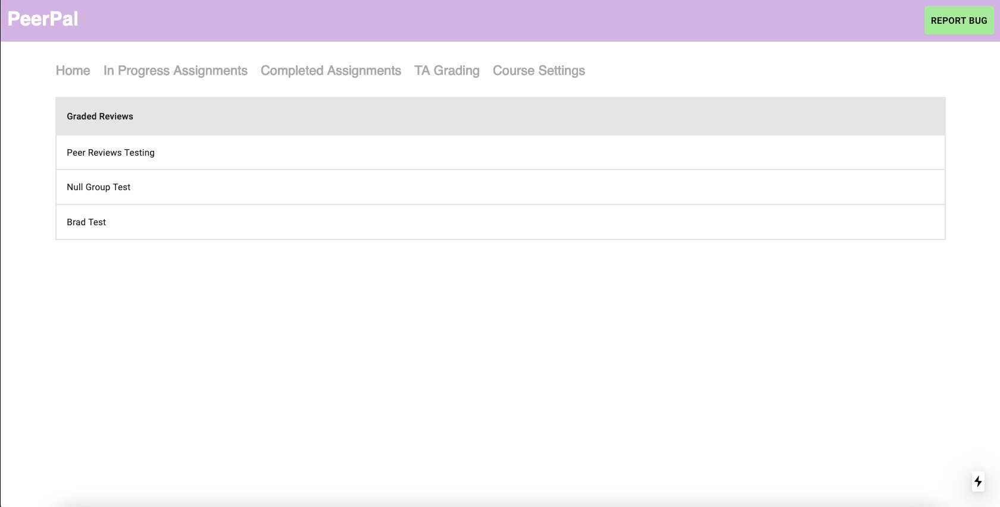
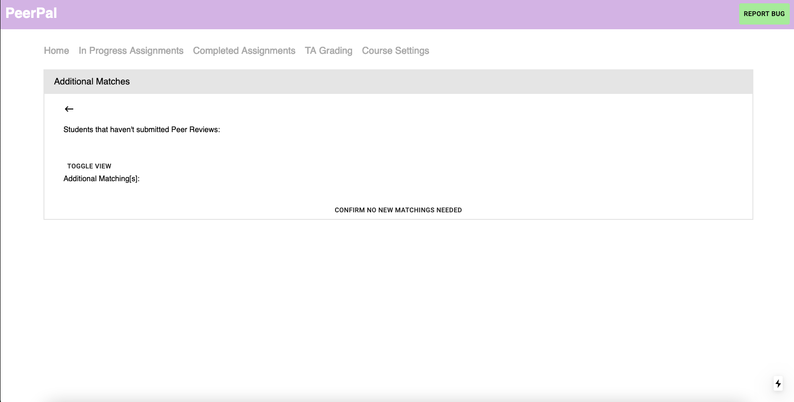

PeerPal App Walkthrough (Instructors)
=====================================

Instructor Homepage
-------------------
The homepage is the first page seen by the instructor after launching the PeerPal application from Canvas.

1. **Nav Bar**: The Nav Bar consists of clickable links to other pages in the PeerPal application (explained
below).

2. **Enabled Assignments**: The Enabled Assignments section displays all assignments from Canvas which 
have been configured for peer grading in PeerPal. Each assignment can be clicked to display assignment 
checklists.

3. **Completed Assignments**: This section displays all assignments in which the peer grading process has
been completed. Each assignment can be clicked to display assignment checklists.

4. **Enablable Assignments**: This section displays all assignments in Canvas which haven't been (but can 
be) enabled for peer grading.

In Progress Assignments
-----------------------

The "In Progress Assignments" page is accessible from the Nav Bar. Similar to the **Enabled Assignments**
section on the homepage, it displays assignments which have been configured for peer grading in PeerPal.

Completed Assignments
---------------------

The "Completed Assignments" page is accessible from the Nav Bar. Similar to the **Completed Assignments**
section on the homepage, it displays assignments in which the Peer Grading process has been completed.

Assignment Checklist
------------------------
Assignment checklists are viewable after clicking on any assignment listed in the sections/pages described 
above.

The assignment checklist serves as a method of tracking the progress of peer grading assignments as well 
as addressing any action items needed to continue the peer grading process.

Initialize Peer Review Assignment
^^^^^^^^^^^^^^^^^^^^^^^^^^^^^^^^^
The "Initialize Peer Review Assignment" page is the first item in the peer grading process which sets up 
the peer grading assignment.

1. **Name/group Settings**: This section allows instructors to set the name of the peer review assignment 
as well as select an assignment group from Canvas.0s

2. **Date settings**: This section allows instructors to select the due date for their peer review assitnment. 
The original assignment date is pulled from Canvas and displayed as well.0s

3. **Rubric settings**: This section allows users to select the rubric to use during peer reviewing.0s

4. **Create assignment button**: This button creates the peer review assignment with all of the course 
settings defined on this page.

Peer Matching
^^^^^^^^^^^^^

The "Peer Matching" page allows instructors to select the "Peer Load", "Grader Load", and "Graders" to use
when running the Review Matching Algorithm. See the Algorithms section for more info on these settings.

Additonal Matches
^^^^^^^^^^^^^^^^^

This page displays students who haven't completed their peer reviews. Instructors can create additional 
matchings by manually assigning unfinished peer reviews to TAs. Once additional matchings have been 
completed, instructors click the "CONFIRM NO NEW MATCHINGS NEEDED" button.