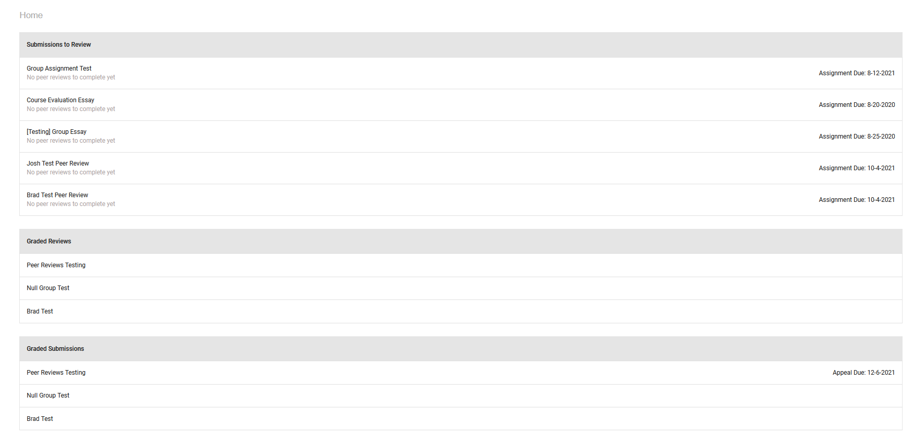
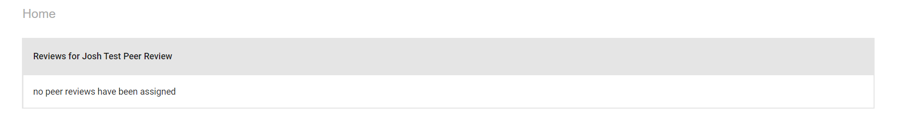
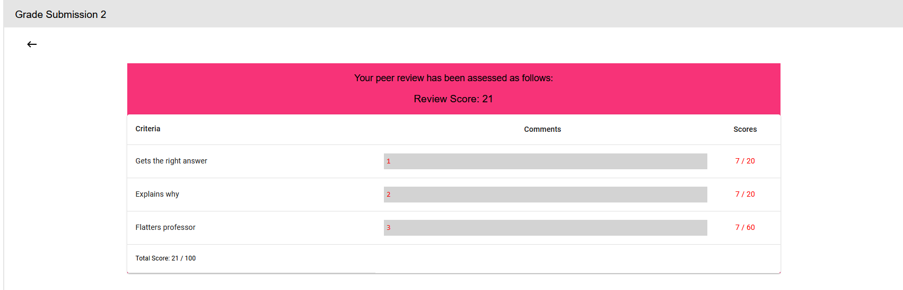
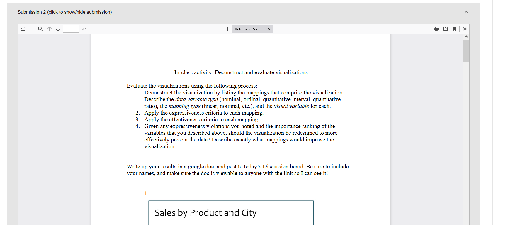
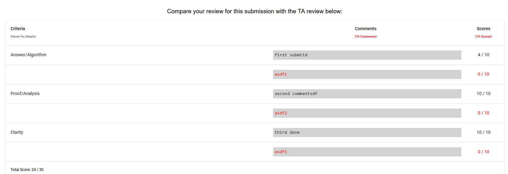

PeerPal App Walkthrough (Students)
=====================================

All three sections below are on the Home page viewable by students. Each assignment in each section is clickable for more details. 

Home
----
The homepage is the first page seen by the student after launching Peerpal. 

    *Home page seen by students*

Submissions to Review
---------------------
Under the assignment name, the next task to be done by the student will be listed below in grey. When peer reviews are assigned, the student can click on an assignment and will have a list of peer reviews to complete. 
Otherwise, the page the student will see when there are no peer reviews is shown below. 

    *Page for peer reviews to be completed by students*

Graded Reviews
--------------
Students can view how they were graded on their peer reviews by the TAs. The scores are listed in a table like the one below. 

    *Table of student's peer review scores*

The second part is the submission of the student they graded. 

    *Submission of another student that the student graded*

The third section is the TA's score and comments and shows the TA's grading of the same submission so that the student can compare their peer review to the TA's. 

    *TA comments and score on the same submission*

Graded Submissions
------------------
Students can view their grades for their peer reviews. 